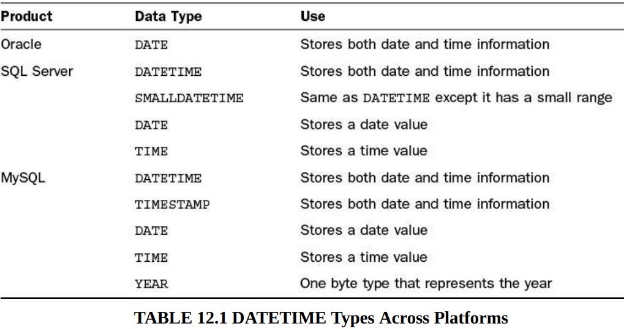
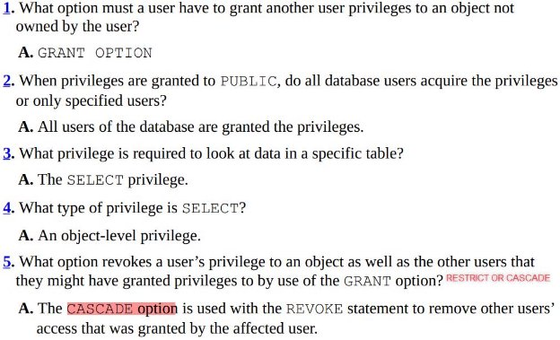

[Part I: An SQL concepts Overview](#_page3_x72.00_y72.00)

[Hour 1: Welcome to the World of SQL](#_page3_x72.00_y99.16)

[Part II: Building Your Database](#_page3_x72.00_y131.67)

[Hour 2: Defining Data Structures](#_page3_x72.00_y172.83)

[Basic Data Types](#_page3_x72.00_y205.34)

[Large Object Types](#_page3_x72.00_y427.64)

[Numeric Types](#_page3_x72.00_y521.93)

[Floating-Point Decimals](#_page4_x72.00_y493.46)

[User-Defined Types](#_page4_x72.00_y616.85)

[Hour 3: Managing Database Objects](#_page5_x72.00_y72.00)

[Basic Statements](#_page5_x72.00_y94.51)

[Integrity Constraints](#_page5_x72.00_y253.35)

[Hour 4: Normalization](#_page5_x72.00_y387.53)

[Normalization vs Denormalization](#_page5_x72.00_y426.05)

[Hour 5: Manipulating Data](#_page5_x72.00_y470.46)

[Hour 6: Managing Database Transactions](#_page5_x72.00_y551.96)

[Part III: Getting Effective Results from Queries](#_page6_x72.00_y429.67)

[Hour 7: Introduction to Database Queries](#_page6_x72.00_y474.83)

[Hour 8: Using Operators to Categorize Data](#_page6_x72.00_y564.66)

[(NOT) BETWEEN min AND max](#_page7_x72.00_y72.00)

[(NOT) IN a List](#_page7_x72.00_y136.36)

[(NOT) LIKE similar values](#_page7_x72.00_y186.00)

[(NOT) EXISTS](#_page7_x72.00_y490.90)

[ALL, SOME and ANY](#_page9_x72.00_y72.00)

[Arithmetic Operators +, -, *, /](#_page9_x72.00_y371.79)

[Hour 9: Summarizing Data Results from a Query ](#_page9_x72.00_y448.87)[Hour 10: Sorting and Group Data](#_page9_x72.00_y646.09)

[GROUP BY vs ORDER BY](#_page10_x72.00_y292.94)

[CUBE and ROLLUP](#_page10_x72.00_y419.78)

[The HAVING clause](#_page10_x72.00_y482.74)

[Hour 11: Restructuring the Appearance of Data](#_page11_x72.00_y173.64)

[Common Character Functions ](#_page11_x72.00_y212.16)[Miscellaneous Character Functions ](#_page11_x72.00_y371.21)[Conversion Functions](#_page11_x72.00_y651.77)

[Hour 12: Understanding Dates and Times](#_page12_x72.00_y130.19)

[Part IV: Building Sophisticated Database Queries](#_page13_x72.00_y72.00)

[Hour 13: Joining Tables in Queries](#_page13_x72.00_y99.16)

[Using a Base Table](#_page13_x72.00_y204.40)

[Hour 14: Using Subqueries to Define Unknown Data](#_page13_x72.00_y311.00)

[What is a Subquery?](#_page13_x72.00_y349.52)

[Notes with subqueries](#_page13_x72.00_y485.68)

[Tip: Using Subqueries for Unknown Values ](#_page14_x72.00_y72.00)[Correlated Subqueries](#_page14_x72.00_y280.36)

[Hour 15: Combining Multiple Queries into One](#_page14_x72.00_y402.62)

[Compound Queries](#_page14_x72.00_y441.14)

[ORDER BY with a Compound Query](#_page14_x72.00_y665.05)

[GROUP BY with a Compound Query](#_page15_x72.00_y200.97)

[Part V: SQL Performance Tuning](#_page15_x72.00_y469.56)

[Hour 16: Using Indexes to Improve Performance](#_page15_x72.00_y514.72)

[Types of Indexes](#_page16_x72.00_y72.00)

[When Should Indexes Be Considered?](#_page16_x72.00_y386.15)

[When Should Indexes Be Avoided?](#_page16_x72.00_y611.35)

[Hour 17: Improving Database Performance](#_page17_x72.00_y247.67)

[What Is SQL Statement Tuning?](#_page17_x72.00_y286.19)

[Format Your SQL Statement](#_page17_x72.00_y419.00)

[Formatting a Statement for Readability ](#_page17_x72.00_y452.87)[Arranging Tables in the FROM Clause ](#_page18_x72.00_y255.48)[Ordering Join Conditions](#_page18_x72.00_y355.42)

[The Most Restrictive Condition](#_page18_x72.00_y618.61)

[Other Performance Considerations](#_page19_x72.00_y72.00)

[Part VI: Using SQL to Manage Users and Security](#_page19_x72.00_y295.52)

[Hour 18: Managing Database Users](#_page19_x72.00_y340.67)

[Hour 19: Managing Database Security](#_page19_x72.00_y475.01)

[What Are Privileges?](#_page19_x72.00_y513.53)

[System Privileges vs Object Privileges](#_page19_x72.00_y616.13)

[The PUBLIC Database Account](#_page20_x72.00_y188.37)

[Groups of Privileges](#_page20_x72.00_y280.42)

[Controlling Privileges Through Roles](#_page20_x72.00_y314.29)

[Part VII: Summarized Data Structures](#_page21_x72.00_y72.00)

[Hour 20: Creating and Using Views and Synonyms](#_page21_x72.00_y99.16)

[What Is a View?](#_page21_x72.00_y131.67)

[Utilizing Views as a Form of Security](#_page21_x72.00_y292.46)

[Utilizing Views to Maintain Summarized Data ](#_page21_x72.00_y326.32)[Performance Impact of Nested Views](#_page21_x72.00_y356.20)

[What Is a Synonym?](#_page21_x72.00_y429.70)

[Hour 21: Working with the System catalog](#_page21_x72.00_y492.66)

[What Is the System Catalog?](#_page21_x72.00_y531.18)

[What Is Contained in the System Catalog?](#_page22_x72.00_y72.00)

[Part VIII: Applying SQL Fundamentals in Today’s World](#_page22_x72.00_y368.25)

[Hour 22: Advanced SQL Topics](#_page22_x72.00_y413.41)

[Cursors](#_page22_x72.00_y445.92)

[Opening a Cursor](#_page22_x72.00_y563.07)

[Fetching Data from a Cursor](#_page22_x72.00_y637.25)

[Closing a Cursor](#_page23_x72.00_y101.09)

[Stored Procedures and Functions](#_page23_x72.00_y160.73)

[Triggers](#_page23_x72.00_y310.97)

[Dynamic SQL](#_page23_x72.00_y446.66)

[Call-Level Interface](#_page23_x72.00_y567.81)

[Hour 23: Extending SQL to the Enterprise, the Internet, and the Intranet ](#_page23_x72.00_y616.22)[Hour 24: Extensions to Standard SQL](#_page23_x72.00_y654.74)

Part I: An SQL concepts Overview

Hour 1: Welcome to the World of SQL

Part II: Building Your Database

Hour 2: Defining Data Structures

Basic Data Types

- String
- Numeric
- Date and time

Fixed-Length Strings

SQL standard: CHARACTER(n)

Varying-Length Strings

SQL standard: CHARACTER VARYING(n)

VARBINARY: contains a variable length of bytes and is used to store some kind of digital data such as an image file.

Large Object Types

BLOB : is a binary large object and is useful to store binary media files such as images or mp3s

TEXT : can be treated as a largeVARCHAR field and is useful to store large sets of character data such as HTML input from the entries of a blog site.

Numeric Types

SQL standard:

BIT(***n***)

BIT VARYING(***n***) DECIMAL(***p,s***)

INTEGER

SMALLINT

BIGINT

FLOAT(***p,s***)

DOUBLE PRECISION(***p,s***) REAL(***s***)

***p*: p** means Precision. It represents a number identifying the allocated or max length of the particular field for each appropriate definition

***s*: s** means Scale. It represents a number to the right of the decimal point

Decimal data type is a numeric data type used in SQL to represent fixed-point numbers.

[Refer to this link to understand deeply about Decimal data type](https://www.sqlshack.com/understanding-sql-decimal-data-type/)

The **space** consumption of SQL Decimal data type is based on **the column definition** and not on the size of the value being assigned to it.

DECIMAL(4,2)

- max value: 99.99
- space storage for each number: 5 bytes

Floating-Point Decimals

REAL : a data type for a column with single-precision, floating-point numbers. The precision must be between **1 and 21 inclusive** is considered as a single-precision floating point.

DOUBLE PRECISION : a data type for a column with double-precision, floating-point numbers. The precision must be between **22 and 53 inclusive** is considered as a single-precision floating point.

User-Defined Types CREATE TYPE statement

Hour 3: Managing Database Objects

Basic Statements

CREATE TABLE

- can create new tables from an existing table by combining with SELECT statement

ALTER TABLE

- **Attributes** of a column refer to the rules and behavior of data in a column
- Modify **these attributes** of a column: data type/length, precision or scale/ can contain NULL

Integrity Constraints

PRIMARY KEY

UNIQUE

- a column with UNIQUE can be NULL FOREIGN KEY

NOT NULL

CHECK

Hour 4: Normalization

Normalization vs Denormalization

- Which trade-offs?

Hour 5: Manipulating Data

INSERT

UPDATE

DELETE

Hour 6: Managing Database Transactions

COMMIT ROLLBACK SAVEPOINT

Part III: Getting Effective Results from Queries

Hour 7: Introduction to Database Queries

SELECT FROM WHERE ORDER BY

Hour 8: Using Operators to Categorize Data

Operators are used with the WHERE clause ofSELECT.

Comparison operators: =, <> / !=, >, <, >=, <=

Logical operators:IS NULL, BETWEEN, IN, LIKE, EXISTS, UNIQUE, ALL, SOME, ANY

Operators used to negate conditions

Arithmetic operators

(NOT) BETWEEN *min* AND *max*

- inclusive *min* and *max*

WHERE SEATING BETWEEN 200 AND 300

(NOT) IN a List

WHERE SEATING IN (200, 300, 400)

(NOT) LIKE similar values

2 wildcard operators:

- % : zero, one, or multiple characters
- \_ : a single character or number

Find any values starting with B:

WHERE AIRCRAFTTYPE LIKE ‘B%’

Finds any values that have DOUGLAS in any position:

WHERE AIRCRAFTTYPE LIKE ‘%DOUGLAS%’

Finds any values that have ir in the second and third positions:

WHERE AIRCRAFTTYPE LIKE ‘\_ir%’

Finds any values that start with A and are at least three characters in length: WHERE AIRCRAFTTYPE LIKE ‘A\_%\_%’

Finds any values that end with 0:

WHERE AIRCRAFTTYPE LIKE ‘%0’

Finds any values that have a c in the second position and end with a 1: WHERE AIRCRAFTTYPE LIKE ‘\_c%1’

Finds any values in a five-digit number that start with 2 and end with 3: WHERE AIRCRAFTTYPE LIKE ‘2\_\_\_3’

(NOT) EXISTS

If a subquery returns **ANY** rows at all,EXISTS ***subquery*** isTRUE, andNOT EXISTS ***subquery*** isFALSE.

[Detail here](https://dev.mysql.com/doc/refman/8.0/en/exists-and-not-exists-subqueries.html)

SELECT DISTINCT store\_type FROM stores s1 [1]

WHERE NOT EXISTS (

SELECT \* FROM cities WHERE NOT EXISTS ( [2] SELECT \* FROM cities\_stores [3]

WHERE cities\_stores.city = cities.city

AND cities\_stores.store\_type = stores.store\_type));

[3]’s result is exactly the table cities\_stores

[2]’s result is the answer for the question: which cities that store does not present in?

ith

[1]’s result is the answer for the question: which stores do appear in all cities.

Stores

|store\_type|
| - |
|ST1|
|ST2|
|ST3|
|ST4|

Cities Cities\_Stores

|store\_type|city|
| - | - |
|ST1|CT1|
|ST1|CT2|
|ST2|CT1|
|ST3|CT1|
|ST3|CT2|
|ST3|CT3|

city

CT1 CT2 CT3

[2]’s result

|store\_type|city|
| - | - |
|ST1|CT3|
|ST2|CT2|
|ST2|CT3|
|ST4|CT1|
|ST4|CT2|
|ST4|CT3|

ST1 does not exist in CT3

ST2 does not exist in CT2 and CT3

ST4 does not exist in CT1, CT2 and CT3

[1]’s result

|store\_type|
| - |
|ST3|

ST3 does not exist in the table of [2]’s result. In other words, ST3 does appear/exist in all cities CT1, CT2 and CT3

ALL, SOME and ANY

TheALL operator is used to compare a value to all values in another value set. SELECT \*

FROM AIRCRAFT

WHERE SEATING > ALL ( SELECT SEATING

FROM AIRCRAFT

WHERE AIRCRAFTTYPE=‘Boeing 777’ );

SOME is as an alias forANY

TheANY operator compares a value to any applicable value in the list according to the condition.

SELECT s1 FROM t1 WHERE s1 <> ANY (SELECT s1 FROM t2); SELECT s1 FROM t1 WHERE s1 <> SOME (SELECT s1 FROM t2);

<> SOME is an alias for <> ANY

*b*: the result from SELECT s1 FROM t2

The meaning, there is some*b* to which*s1* is not equal. In other words,*TRUE* if there is at least one record from *b* that is different from*s1*.

<> ALL is an alias for NOT IN

Arithmetic Operators +, -, \*, /

SELECT TRAVELTIME + 30 AS DELAY\_TIME FROM ROUTES; SELECT \* FROM ROUTES WHERE (TRAVELTIME + 30) > 1080;

Hour 9: Summarizing Data Results from a Query

Functions are keywords in SQL used **to manipulate values within columns** for output purposes. A function is a command normally used with a column name or expression that processes the incoming data to produce a result.

The basic set of aggregate functions: COUNT

SUM

MAX

MIN

AVG

Hour 10: Sorting and Group Data

Learn how to break returned data from a query into groups for improved readability**using aggregate functions + GROUP BY**

The selected columns (the column list following theSELECT keyword in the query) are the columns you can reference in theGROUP BY clause.

SELECT LASTNAME, **FIRSTNAME** FROM EMPLOYEES

GROUP BY LASTNAME;

→Error: The column EMPLOYEES.FirstName is invalid in the select list because it is not contained in either an aggregate function or theGROUP BY clause.

SELECT LASTNAME, **FIRSTNAME** FROM EMPLOYEES

GROUP BY LASTNAME, **FIRSTNAME**;

- NO ERROR

GROUP BY vs ORDER BY

- TheGROUP BY clause is designed to group identical data, whereas theORDER BY clause is designed merely to put data into a specific order. You can useGROUP BY andORDER BY in the sameSELECT statement, but you must follow a specific order.
- You can use theGROUP BY clause in theCREATE VIEW statement to sort data, but the ORDER BY clause is **not allowed** in theCREATE VIEW statement.

CUBE and ROLLUP

[Rollup in MySQL](https://dev.mysql.com/doc/refman/8.0/en/group-by-modifiers.html)

Cube is not supported in MySQL

TheHAVING clause

- TheHAVING clause when used with theGROUP BY clause in aSELECT statement tells GROUP BY which groups to include in the output.

-HAVING is toGROUP BY asWHERE is toSELECT

-WHERE clause places **conditions** on the selected columns, andHAVING clause places **conditions** on groups created byGROUP BY clause.

|SELECT FROM WHERE GROUP BY HAVING ORDER BY|
SELECT ***COLUMN1, COLUMN2*** FROM ***TABLE1, TABLE2*** WHERE ***CONDITIONS***

GROUP BY ***COLUMN1, COLUMN2*** HAVING ***CONDITIONS***

ORDER BY ***COLUMN1, COLUMN2***
|
| :- | :- |

E.g: Display only the cities that have an average salary equal to $71,000.

SELECT CITY, AVG(PAYRATE) AS AVG\_PAYRATE, AVG(SALARY) AS AVG\_SALARY FROM EMPLOYEES

GROUP BY CITY

HAVING AVG(SALARY)=71000

ORDER BY 1;

Hour 11: Restructuring the Appearance of Data

Common Character Functions

[In MySQL ](https://dev.mysql.com/doc/refman/8.0/en/string-functions.html)CONCAT UPPER LOWER SUBSTR TRANSLATE REPLACE LTRIM RTRIM

Miscellaneous Character Functions

LENGTH

ISNULL

LPAD (left pad) RPAD (right pad) ASCII

Mathematical Functions [In MySQL](https://dev.mysql.com/doc/refman/8.0/en/mathematical-functions.html)

ABS (Absolute value) ROUND

SQRT

SIGN

POWER

CEIL/FLOOR

EXP

SIN, COS, TAN

Conversion Functions

These functions are used to convert a data type into another data type.

- Character to numeric
- Numeric to character
- Character to date
- Date to character

Hour 12: Understanding Dates and Times

Which datetime types should be used? You should consider the range of each type. For example, whether you choosetimestamp ordatetime in MySQL for storing birthdate? You should know the difference betweentimestamp anddatetime like [in detail here](https://www.tutorialspoint.com/What-is-the-difference-between-MySQL-DATETIME-and-TIMESTAMP-data-type).

[Date and Time functions in MySQL](https://dev.mysql.com/doc/refman/8.0/en/date-and-time-functions.html#function_datediff)

Part IV: Building Sophisticated Database Queries

Hour 13: Joining Tables in Queries

- Inner joins or Equijoins
- Non-Equijoins
- Outer joins
- Self joins
- Cartesian Product (x) or Cross joins

Using a Base Table

What should you join on? Should you have the need to **retrieve data from two tables that do not have a common column** to join, you **must join on another table** that has a common column or columns to both tables. That table becomes **the base table**. A base table joins one or more tables that have common columns, or joins tables that do not have common columns.

Hour 14: Using Subqueries to Define Unknown Data

What is a Subquery?

- A subquery, aka a *nested query*, is a query embedded within theWHERE clause orHAVING of another query to further restrict data returned by the query.
- A subquery returns data that is used **as a condition in the main query**.
- Subqueries are employed with theSELECT statement and with a data manipulation statement such asINSERT,UPDATE, andDELETE statements.
- use logical and relational operators, such as:=, >, <, <>,!=, IN, NOT IN, AND, OR, and so on.

Notes with subqueries

- Cannot us anORDER BY clause in a subquery, but can use the GROUP BY clause to perform the same functions as theORDER BY clause in a subquery
- Cannot use theBETWEEN operator with a subquery, but can use theBETWEEN operator within the subquery. Weird? Try testing with your implementation (MySQL, Oracle, etc.)

Tip: Using Subqueries for Unknown Values

SELECT E.EMPLOYEEID,E.LASTNAME, A.AIRPORTNAME, E.SALARY FROM EMPLOYEES E

INNER JOIN AIRPORTS A

ON E.AIRPORTID = A.AIRPORTID

WHERE E.SALARY=

(SELECT SALARY

FROM EMPLOYEES

WHERE **EMPLOYEEID=3908**);

Subqueries are frequently used to place conditions on a query when **the exact conditions are unknown**. The salary for3908 in the previous example was unknown, but the subquery was designed to do the footwork for you.

Correlated Subqueries

- A ***correlated subquery*** is a subquery that is dependent upon information in the main query. This means that tables in a subquery can be related to tables in the main query.

Refer back to [~~(NOT) EXISTS~~](#_page7_x72.00_y490.90) to see an interesting example.

- Consider that a subquery must **be evaluated prior to** the main part of the query, so the time that it takes to execute the subquery has a direct effect on the time it takes for the main query to execute.

Hour 15: Combining Multiple Queries into One

Compound Queries

- UsingSET **operators**(UNION, INTERSECT, EXCEPT) to join the two queries.
- To use theSET operators, eachSELECT statement must have **the same number of columns selected**, **the same number of column expressions**, **the same data type**, and **the same order - but they do not have to be the same length**.

UNION/ UNION ALL

- Return the output of two single queries
- ALL for displaying duplicate rows of a result

INTERSECT/ INTERSECT ALL

- Return identical rows between two queries

EXCEPT/ EXCEPT ALL

- Combines twoSELECT statements and returns rows **from the firstSELECT statement that are not returned by the second**SELECT statement. In other words, it returns the results of one query that do not exist in another query.

ORDER BY with a Compound Query

- Only use ONE the ORDER BY clause to order the results of a compound query.

SELECT COLUMN1 [, COLUMN2 ]

FROM TABLE1 [, TABLE2 ]

[ WHERE ]

OPERATOR{UNION | EXCEPT | INTERSECT | UNION ALL} SELECT COLUMN1 [, COLUMN2 ]

FROM TABLE1 [, TABLE2 ]

[ WHERE ]

[ ORDER BY ]

GROUP BY with a Compound Query

UnlikeORDER BY, you can useGROUP BY in **each** SELECT statement of a compound query, **but you also can** use it following all individual queries. In addition, you can use the HAVING clause (sometimes used with theGROUP BY clause) in eachSELECT statement of a compound statement.

SELECT COLUMN1 [, COLUMN2 ]

FROM TABLE1 [, TABLE2 ]

[ WHERE ]

[ GROUP BY ]

[ HAVING ]

OPERATOR {UNION | EXCEPT | INTERSECT | UNION ALL}

SELECT COLUMN1 [, COLUMN2 ]

FROM TABLE1 [, TABLE2 ]

[ WHERE ]

[ GROUP BY ]

[ HAVING ]

[ ORDER BY ]

Part V: SQL Performance Tuning

Hour 16: Using Indexes to Improve Performance

- An index is typically stored separately from the table for which the index was created.
  - Indexes do take up physical space
  - When new data is added to the table, an extra work/overhead needs to add entries to the index
    - modify data can negatively affect the performance of the operations
- Index typically stores information in an orderly tree-like format.

CREATE INDEX ***INDEX\_NAME***

ON ***TABLE\_NAME (COLUMN\_NAME)***

Types of Indexes

1. **Single-Column Indexes**
- Single-Column indexes are most effective when used on columns that are **frequently used alone** in theWHERE clause **as query conditions**.
2. **Unique Indexes**
- Only work on fields that are unique and NOT NULL.
3. **Composite Indexes**
- A composite index is created when indexed fields are frequently used together as conditions in theWHERE clause of a query.
- The order of columns in the index should be considered carefully because it can have a measurable effect on the data retrieval speed. [Refer to this stackoverflow link](https://dba.stackexchange.com/questions/160649/composite-indexes-most-selective-column-first)
- According to the book, it says that the order of the columns in the composite index is also important. The most selective column(1) should be listed first, followed by the next most selective column, and so on. This can help to ensure that the index is used efficiently when searching for data.

**Tip**: In deciding whether to create a single-column index or a composite index, consider the column(s) that you might use frequently in a query’s WHERE clause as filter conditions. If only one column is used, choose a single-column index. If two or more columns are frequently used in the WHERE clause as filters, a composite index would be the best choice.

When Should Indexes Be Considered?

1. Unique indexes are implicitly used with a primary key for the primary key to work.
1. Foreign keys are also excellent candidates for an index because you often use them to join the parent table.
1. Most, if not all, columns used for table joins should be indexed.
1. Columns that you frequently reference in the**ORDER BY andGROUP BY** clauses should be considered for indexes.
1. You should create indexes on columns with a **high number of unique values**, or columns that, when used as filter conditions in theWHERE clause, return **a LOW percentage of rows** of data from a table. This is where **trial and error** might come into play.
1. Last but not least, try different combinations of indexes. There is no cut-and-dried rule for using indexes. The effective use of indexes requires a thorough **knowledge of table relationships**, **query and transaction requirements**, and **the data itself**.

When Should Indexes Be Avoided?

1. Small tables

1 The most selective column is the column that has the most distinct values. When we say a column is selective, we mean that it can be used to filter out a large number of rows from a table. In this context, *restrictive* is also the same meaning *selective*.

2. Columns that return **a HIGH percentage of data rows** when used as a filter condition in a query’s WHERE clause.
2. The performance of a **batch job(2)**can be slowed considerably by the index because the index is also updated as the data is inserted, causing additional overhead. To solve this issue when running a batch job by dropping the index before the batch job and then re-creating the index after the job has completed.
2. Columns that contain a **HIGH** number of**NULL** values.
2. Columns that are frequently manipulated because the maintenance on the index can become excessive.
2. Caution should be taken when creating indexes on a table’s **extremely long keys** because performance is inevitably slowed by high I/O costs.

Hour 17: Improving Database Performance

What Is SQL Statement Tuning?

- SQL statement tuning is the process of optimally building SQL statements to achieve results in the most effective and efficient manner.
- Mainly involve tweaking a statement’s**FROM** and**WHERE** clauses because mostly a database server evaluates a query based on these two clauses.
- Should read the document of the optimizer to follow tips
- Should investigate built-in tools such as a tool that shows the user the execution plan of a SQL statement or a tool that measures the actual elapsed time of a SQL statement.

Format Your SQL Statement Formatting a Statement for Readability

- Should understand how the optimizer of your implementation works to effectively tune a SQL statement
- Some basic rules for making a statement readable follow:
- Begin a new line with each clause
- Use aliases when multiple tables are used in the statement
- Etc.

2 A batch job is a program or script that is designed to process a large amount of data in a single run. Batch jobs are typically run on a regular schedule, such as daily or weekly, and are used to perform tasks such as data backups, data imports, and data exports.

Arranging Tables in the**FROM** Clause

- It might be more beneficial to list the smaller tables first and the larger tables last

Ordering Join Conditions

- The column from a base table, which is used to link tables with one or more common columns on which to join, is normally placed on the right side of a join operation in the WHERE clause
- The tables joined to the base table are normally in order from smallest to largest
- If a base table doesn’t exist, the tables should be listed from smallest to largest, with the largest tables on the right side of the join operation in the WHERE clause
- The join conditions should be in the first position(s) of the WHERE clause followed by the filter conditions

The Most Restrictive Condition

- The condition that is most likely to eliminate the largest number of rows should be placed first in the WHERE clause.
- The most restrictive clauses should be evaluated before the join conditions because join conditions normally return a large number of rows

Other Performance Considerations

- Using the LIKE operator and wildcards (%, \_)
- Using IN predicate instead of the OR operator
- If possible, you should write SQL statements without using the HAVING clause
- Avoiding large *sort operations*[^1] because they are very resource-intensive and time-consuming
  - A large dataset must be stored in memory. If the dataset is too large, the system must use its disk to swap data between memory and disk. This leads to slow down the system and other queries can be also affected and timed out.
  - In addition, soring a too much data is a very expensive operation in terms of using CPU.
  - It is best to schedule queries with large sorts during off-peak database usage so that the performance of most user processes is not affected
- [Using stored procedures](#_page23_x72.00_y160.73)
- Disabling indexes during batch loads
- Can apply the strategy ‘drop and rebuild indexes’

Part VI: Using SQL to Manage Users and Security

Hour 18: Managing Database Users

There are three necessities for managing users in the database.

- First, you must create database user accounts for the proper individuals and services.
- Second, you must grant privileges to the accounts to accommodate the tasks that must be performed within the database.
- Finally, you must either remove a user account from the database or revoke certain privileges within the database from an account.

Hour 19: Managing Database Security

What Are Privileges?

- Privileges are authority levels used to access the database, access objects within the database, manipulate data in the database, and perform various administrative functions within the database. In other words, *privileges* are permissions that determine what actions a user can perform on a database object.
- Privileges can be granted to *users* or *roles*

System Privileges vs Object Privileges

- System privileges refer to permissions that allow a user to perform certain actions within the entire database system. These actions include **creating a database, creating a user, or** **backing up the database**. System privileges are granted to users by database administrators and are not specific to any particular object within the database.
- On the other hand, object privileges refer to permissions that allow a user to perform certain actions on a specific object within the database (database objects), such as a table or view. These actions include **selecting, updating, or deleting data from the object**. Object privileges are granted to users by the owner of the object or by a user with the appropriate system privileges.

The PUBLIC Database Account

- The PUBLIC database user account is a database account that represents all users in the database.
- Caution: PUBLIC privileges can grant **unintended access**

Groups of Privileges

Controlling Privileges Through Roles

Part VII: Summarized Data Structures

Hour 20: Creating and Using Views and Synonyms

What Is a View?

- A view is a virtual table or **a stored query**. That is, a view looks like a table and acts like a table as far as a user is concerned, but it doesn’t require physical storage.
- A view is considered a database object, although it is stored in memory only. It takes up no storage space as do other database objects—other than the space required to store the view definition.
- A view **does not contain data**
- The view’s creator or the schema owner owns the view. The view owner automatically has all applicable privileges on that view and can grant privileges on the view to other users, as with tables.

Utilizing Views as a Form of Security Utilizing Views to Maintain Summarized Data Performance Impact of Nested Views

- The more layers (of views) you have, the more the query engine has to work to come up with an execution plan.

What Is a Synonym?

- A synonym is an alternative name for an object in a database, such as a table, view, or stored procedure.

Hour 21: Working with the System catalog

What Is the System Catalog?

- The ***system catalog (**aka **data dictionary)*** is a collection of tables and views that contain important information about a database.
- A system catalog is available for each database.
- Information in the system catalog defines the structure of the database and information on the data contained therein. For example, the Data Definition Language (DDL) for all tables in the database is stored in the system catalog.
- In other words, a ***system catalog*** is a collection of **metadata** that describes the structure of a database. It contains information about the tables, columns, indexes, and other objects that make up the database.

What Is Contained in the System Catalog?

The system catalog contains information such as the following:

- User accounts and default settings
- Privileges and other security information
- Performance statistics
- Object sizing
- Object growth
- Table structure and storage
- Index structure and storage
- Information on other database objects, such as views, synonyms, triggers, and stored procedures
- Table constraints and referential integrity information
- User sessions
- Auditing information
- Internal database settings
- Locations of database files

The database server maintains the system catalog. For example, when a table is created, the database server inserts the data into the appropriate system catalog table or view. When a table’s structure is modified, appropriate objects in the data dictionary are updated.

Part VIII: Applying SQL Fundamentals in Today’s World

Hour 22: Advanced SQL Topics

Cursors

- A cursor is a mechanism that allows you to traverse through the rows of a result set one at a time. It is similar to a pointer in programming languages.
- When you execute a query that returns multiple rows, the database server creates a result set that contains all the rows that match the query. A cursor allows you to access the rows in the result set one at a time, and perform operations on them as needed.

Opening a Cursor

You cannot access a cursor until you have opened it. When a cursor is opened, the specified cursor’s SELECT statement is executed, and the results of the query are stored in a staging area in memory.

Fetching Data from a Cursor

You can retrieve the contents of the cursor (results from the query) through the FETCH statement after you open the cursor.

How to handle the cursor when fetching to the last item/row? Referring to the document of each particular implementation.

Closing a Cursor

The result set for the cursor is contained in memory until the cursor is closed and the memory is deallocated.

Stored Procedures and Functions

- A stored procedure is a group of one or more SQL statements or functions that are stored in the database, compiled, and ready to be executed by a database user. A stored function is the same as a stored procedure, but a function returns a value.
- A stored procedure is precompiled and stored in **the database server's memory**. When a stored procedure is executed, the database server retrieves the precompiled code from memory and executes it.
- Stored procedures can **also be stored on disk, but they are typically loaded into memory** when they are executed.

Triggers

- A trigger is a special type of stored procedure that is automatically executed in response to certain events or changes in a database. Triggers are typically used to enforce business rules, maintain data integrity, or perform complex calculations.
- Triggers can be defined to execute either before or after a specific event, such as an insert, update, or delete operation on a table. For example, you could define a trigger to automatically update a summary table whenever a new row is inserted into a related table.

Dynamic SQL

- Dynamic SQL allows a programmer or end user to create a SQL statement’s specifics at runtime and pass the statement to the database. The database then returns data into the program variables, which are bound at SQL runtime.
- Although dynamic SQL provides more flexibility for the end user’s query needs, the performance might not compare to that of a stored procedure whose code has already been analyzed by the SQL optimizer.

Call-Level Interface

A call-level interface (CLI) embeds SQL code in a host program, such as ANSI C.

Hour 23: Extending SQL to the Enterprise, the Internet, and the Intranet Hour 24: Extensions to Standard SQL

[^1]: Using the ORDER BY, GROUP BY, and HAVING clauses